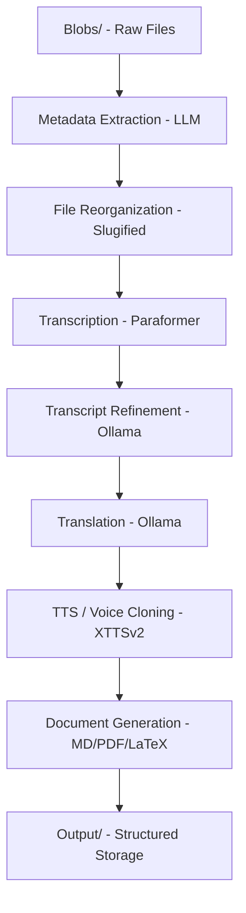

# Sermon Voices - Design Document

## Architecture Overview

Sermon Voices is a high-performance pipeline designed to process sermon audio/video files with AI-powered transcription, translation, and organized file output. While the long-term vision includes a hybrid C++/Python coordination layer for massive scale and system integration, the current core workflow is driven by a flexible Python-based pipeline for maximum agility with modern ML tools.

### Pipeline Philosophy

1.  **Local-First Processing**: 100% of processing occurs on local hardware (optimized for M1/Apple Silicon). No cloud APIs are used, ensuring privacy and cost-efficiency.
2.  **LLM-Driven Metadata**: Instead of fragile regex-based parsing, we use local LLMs (via Ollama) to extract structured metadata from file paths and names.

1.  **Metadata Phase (`src/process_metadata.py`)**:
    - Scans `blobs/` for new files.
    - Uses LLM to extract metadata (preacher, series, title, etc.).
    - Moves/copies files to a structured directory in `output/`.

2.  **Audio Phase (`src/process_audio.py`)**:
    - Focuses on the original language.
    - Transcription and LLM-based Refinement of the original text.

3.  **Translation & TTS Phase (`src/process_translation.py`)**:
    - Translates refined transcript to English.
    - Generates English audio via voice cloning (XTTS v2).

4.  **Document Phase (`src/process_pdf.py`)**:
    - Generates Markdown, LaTeX, and PDF formats for the English transcript.

### Core Workflow



## Metadata & Tracking

### 1. Content Hashing
To prevent redundant processing, every file in the `blobs/` directory is hashed. The hash is stored in the processing status to track if a file has been modified even if its name remains the same.

### 2. Metadata Schema (metadata.json)

The central source of truth for each sermon file.

```json
{
  "id": "stephen-tong_romans_001_16-17_20240115",
  "content_hash": "sha256:7e9a...",
  "preacher": {
    "original": "唐崇荣",
    "en_slug": "stephen-tong"
  },
  "series": {
    "original": "罗马书",
    "en_slug": "romans"
  },
  "title": {
    "original": "上帝的大能",
    "en_slug": "the-power-of-god"
  },
  "sequence": "001",
  "scriptures": [
    {
      "book": "Romans",
      "chapter": 1,
      "verses": "16-17"
    }
  ],
  "created_at": "2024-01-15",
  "audio_metadata": {
    "duration": 1845,
    "bitrate": 128
  },
  "processing": {
    "status": "completed",
    "last_run": "2024-02-03T10:00:00Z",
    "steps": ["transcribed", "translated", "tts_generated"]
  }
}
```
### 3. Output Directory Structure

The goal is to keep all assets for a single sermon in one place, easily accessible and ready for object storage.

**Pattern:**
`output/<preacher_en_slug>/<series_en_slug>/<sequence>_<title_en_slug>/`

**Example:**
```
output/stephen-tong/romans/001_the-power-of-god/
├── original.mp3           # Original audio file
├── metadata.json          # Extracted metadata
├── transcript_zh.txt      # Refined Chinese transcript
├── transcript_en.txt      # Translated English transcript
├── audio_en_cloned.mp3    # TTS output with cloned voice
└── ...
```

This structure makes it "easy to locate" everything related to a specific sermon without jumping between separate top-level folders.

## Implementation Components (Python)

### 1. Metadata Extractor (`src/process_metadata.py`)
Uses local LLM prompts to "guess" and extract structured data from chaotic folder structures and filenames found in `blobs/`. Can be run independently.

### 2. Transcription Engine
Leverages `faster-whisper` for high-speed local transcription, utilizing CoreML/MPS on Apple Silicon.

(Superseded for captioning by the FunASR pipeline below — kept here for the original
process_audio.py phase, which is unrelated to caption generation.)

### 3. LLM Refiner
Uses Ollama (e.g., `llama3`) to correct OCR-like errors in transcripts, improve punctuation, and identify speaker segments.

### 4. Translation & TTS
- **Translation**: Batch-processed via Ollama.
- **TTS**: Coqui XTTS v2 for high-quality voice cloning, ensuring the translated sermon sounds like the original preacher.

## Caption Pipeline (`scripts/transcribe_to_captions.py` + `run_captions.sh`)

Separate from the phases above: generates `.vtt`/`.lrc` captions for already-published S3
audio, using local ASR only.

**ASR stack (FunASR `AutoModel`, chained):**
- `paraformer-zh` — non-autoregressive Chinese ASR
- `fsmn-vad` — voice-activity detection (caps segments at 20s)
- `ct-punc` — punctuation restoration
- Hotword biasing via `output/bible_hotwords_combined_zh.txt` (scripture names/terms) —
  main accuracy lever for sermon audio

**Long-audio windowing:** episodes up to 150min are decoded once to 16kHz mono WAV, then
cut into ~20min windows. Cut points snap to the locally quietest moment (numpy amplitude
scan over a 45s search band) so splits land in silence, not mid-sentence. Timestamps are
offset back into absolute episode time after each window.

**Memory-as-restart-signal:** MPS never releases the memory pool it grows during
inference (~3.7GB/window) — a long-lived worker inevitably OOMs. Instead of fighting the
leak, `Budget` polls actual MPS driver-allocated memory after each window, tracks the
largest per-window jump as a safety margin, and exits with code `75` ("more work
remains") once `pool + margin ≥ --mem-ceiling-gb` (default 12GB). `run_captions.sh` is a
supervisor loop: restart immediately on 75, restart after 60s on any other failure, stop
on exit 0. This is what lets a multi-thousand-episode run complete over several days
unattended, across thousands of worker restarts.

**Two-level checkpointing** (makes restarts free):
- Episode-level: one paginated `list-objects-v2` call at startup skips episodes already
  captioned on S3.
- Window-level: `asr_segments.partial.json` saves sentence results after every window, so
  a mid-episode restart resumes at the next window. Decoded WAVs are cached in `/tmp`
  (keyed by S3 key) so restarts skip re-decoding the mp3.

**Cue construction:** sentence-level output (with per-token timestamps) is split at
Chinese punctuation into caption-sized cues (≤28 chars, ≤8s), then short adjacent cues
are remerged if they still fit. Same cue list renders `.vtt` (standard captions) and
`.lrc` (lyrics-style players); raw `asr_segments.json` is kept locally so formats can be
rebuilt without re-running ASR.

## Technical Decisions

- **Slugification**: Using `python-slugify` to ensure all file paths are URL-safe and consistent.
- **Persistence**: Using `output/processed.txt` to track processed original files for the metadata phase. Audio phase relies on file existence in the output directory for idempotency.
- **Configuration**: Centralized configuration in `src/constants.py`.
